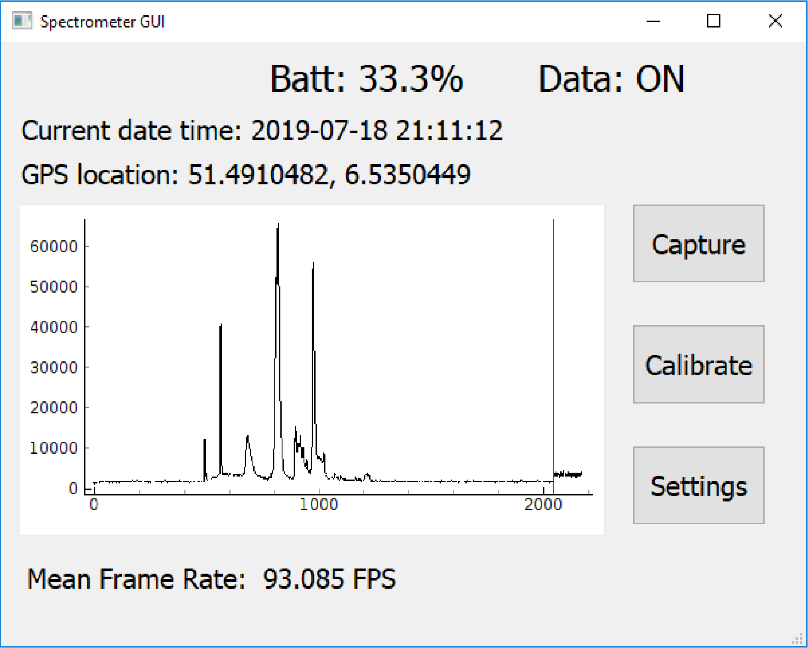

# Hochschule Rhein-waal Applied Research Project SS19 
## Project: Development of an open-source broadband field spectrometer
##### Supervised by Prof. Timo Kahl
##### Group members: Moritz Prüm, Andreas Markwart, Marcel Dogotari, Thi Yen Thu Nguyen

### Problem Statement
Spectroscopy is an important data collection method for various fields and applications, however, existing field spectrometers on the market are not only expensive but also come as black-boxes that prevent scientists from customizing them to their needs. 

A market research has been conducted to analyse commercial solutions, their functionalities and shortcomings. Market leaders confine the users to their own software and hardware solution.

### Solution/Experiment/Design
This project aims to develop a prototype of an open-source field spectrometer using easily available components. A major feature of the intended prototype is customization in both hardware and software. As a result, users can easily tailor it to suit their specific use-cases.

*Fig. 1: Open-source field spectrometer prototype*

### Implementation
The field spectrometer prototype consists of 2 offthe-shelf spectrometers from Ocean Optics (Flame VIS, Flame NIR) [^1], [^2] and an embedded computer (Raspberry Pi 3) amongst others. The acquired sensor data is geo-referenced and timestamped. Addtionally, an RGB image of the measured area is or can be captured.

*Fig. 2: High-level software architecture*

### Results and Discussion 
The spectrum is shown live within the GUI. The project is fully documented and published on this Github repository.

*Fig. 3: GUI with real time graph depicting a reflectance panel measurement*

### Outlook
The prototype developed in this project acts as a reference implementation that can be modified for different use-cases. The prototype can be improved upon by adding extra features, for example, an irradiance sensor and support for different spectrometer models.

[^1]: Ocean Optics, Inc. (n.d.) Flame Spectrometer, Available from https://oceanoptics.com/product/flame-spectrometer [Accessed 03 July 2019]
[^2]: Ocean Optics, Inc. (n.d.) Flame-NIR Spectrometer, Available from https://oceanoptics.com/product/flame-nir-spectrometer [Accessed 03 July 2019]