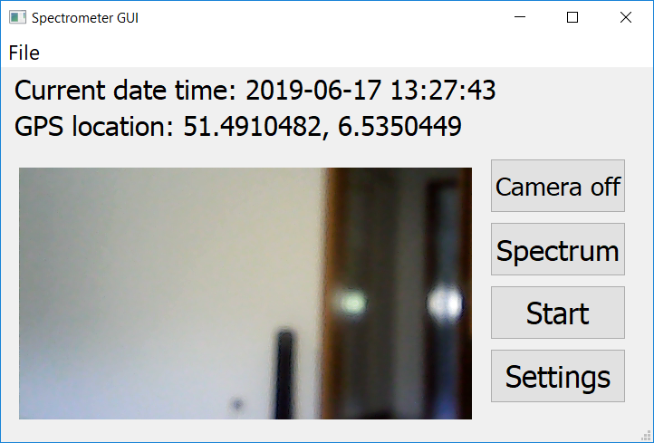

### GUI app usage manual
#### Tag history
- b130619: GUI works with RTC, Neopixel, matchbox keyboard (requires Raspbian image 130619)
- b170619: b130619 + GUI works with Camera (requires building openCV - Raspbian image to be created)

#### Running the app
Make sure all libraries are installed for the GUI to function properly.
- In current folder, run `sudo python3 main.py` to launch the GUI app.
#### GUI app manual

##### Touch buttons
- **Start/Stop** toggle button
  - Start: Run the data collection from hyperstrectral sensors
  - Stop: Stop the data collection from hyperstrectral sensors
- **Camera on/Camera off** toggle button
  - Enable/ disable camera preview
- **Settings** button
  - Show a pop up window to edit configurations
... (more to be added and explained)
##### LED indicators
- Battery LED indicator
   - Red: battery critical
   - Yellow: battery weak
   - Green: battery good
- Data LED indicator
   - Blue: hyperspectral data transmission in progress
   - Off: no hyperspectral data transmission