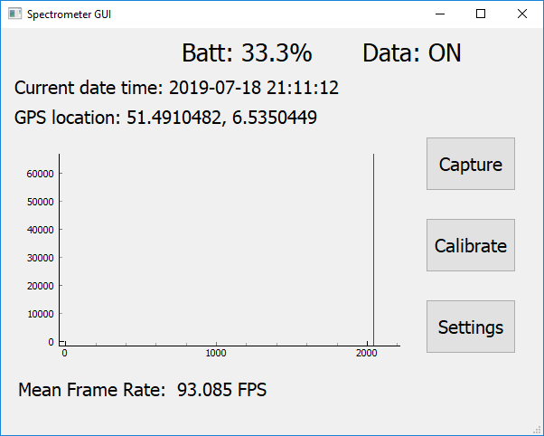
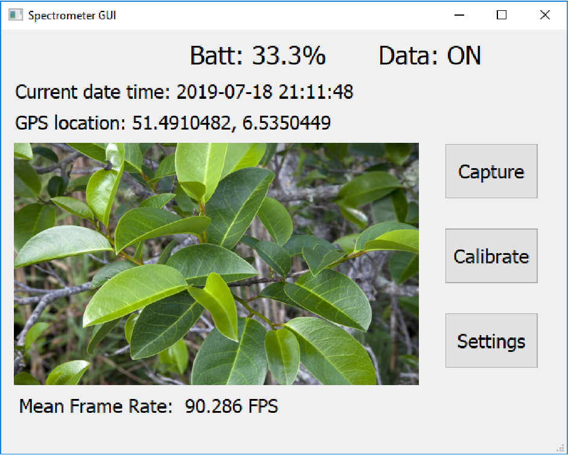
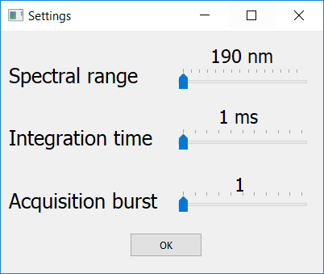

### GUI app usage manual
#### Software tag history
- b130619: GUI works with RTC, Neopixel, matchbox keyboard (requires Raspbian image 130619)
- b170619: b130619 + GUI works with Camera (requires building openCV - Raspbian image to be created)
   - Update 240619: removed due to failure to compile OpenCV on Raspberry Pi Zero
- b180719: GUI works with spectrometer sensors, power electronics & camera (requires Raspbian image 120719)

#### Running the app
- Flash SD card with latest system image containing all required dependecies as instructed [here](../../documentation/image_instructions.md).
- Get the latest zipped Source Code version 180719 from https://github.com/yenthusiastic/ARP07/tags
- Extract the zip file and run the GUI
```bash
cd ARP07-b180719
sudo python3 main.py        #sudo is required to control GPIO pins
```
#### GUI app manual
##### Main Spectrometer Window

##### Camera capture window

###### Labels
- **Batt** label: display battery level (in %)
   - Battery LED indicator
      - Red: battery below 30%
      - Yellow: battery between 30% and 70%
      - Green: battery above 70%
- **Data** label: display status of data transmission to USB drives
   - Data LED indicator
      - Blue: hyperspectral data transmission in progress
      - Off: no hyperspectral data transmission
- **Date time** label
   - Show current date time (obtained from RTC)
- **Location** label
   - Show current location (latitude & longitude, obtain from GPS)
###### Touch buttons
- **Capture** toggle
  - Press one to capture a frame from camera and display it in GUI. 
  - Press again to return to spectrum view
- **Calibrate** button
   - Calibrate the spectrometers
- **Settings** button
  - Show a pop-up window to edit configurations for spectrometers

##### Settings pop-up window

###### Sliders
- **Spectral range** slider
   - Min: 190 nm
   - Max: 1650 nm
   - Step size: 100 nm
- **Integration time** slider
   - Min: 1 ms
   - Max: 1000 ms
   - Step size: 100 ms
- **Acquisition burst** slider
   - Min: 1 
   - Max: 100 
   - Step size: 10
- **OK** button
   - confirm the new parameter values
