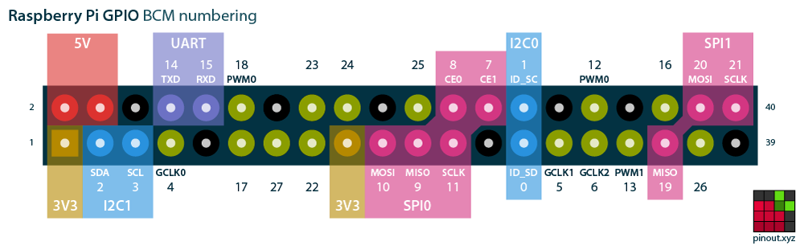
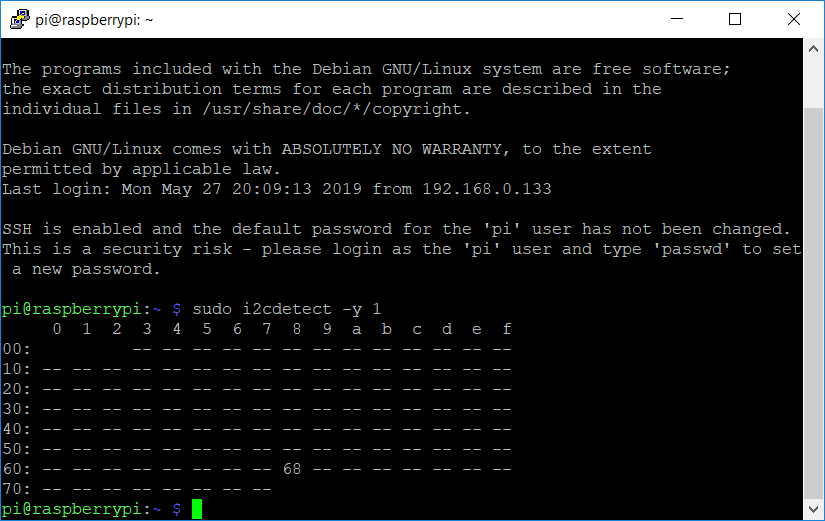

#### Getting the Pi Zero to work with DS3231 RTC module from Adafruit 
- To enable I2C interface on the Pi (to communicate with the sensor), type in command
```
sudo raspi-config
```
- Go to **Inferfacing Options** -> **I2C** and enable it.
- Shut down the Pi `sudo ahutdown -h now`
- Connect DS3231 RTC module to Pi Zero according to following wiring schema

Raspberry Pi pin | RTC module pin 
---------|----------
 5V | Vin 
 GND | GND 
 SDA | SDA
 SCL | SCL



- Power RTC module with a CR1220 coin cell and turn on the Pi Zero again. 
- List the connected I2C devices on the Pi using the command `sudo i2cdetect -y 1`
- The output will show the I2C address of the DS3231 module. By default of the manufacturer (Adafruit), the I2C address of this module is 0x68, which corresponds with the terminal output:

