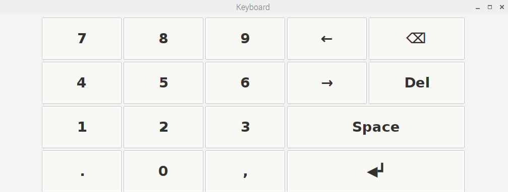

### Development platform installations
Development platform: Windows 10
#### Installing Python 3.5
##### Option 1: Direct installation
Download and install [Python 3.5 for Windowss](https://www.python.org/downloads/windows/) (tested working with v3.5.3)
##### Option 2: Miniconda virtual environment
Install [Miniconda](https://docs.conda.io/en/latest/miniconda.html#) (comes with Python 3.7.3 and allows development in virtual environment)
#### Installing PyQt for GUI app development
##### Option 1: Install from executable
- Download the PyQt5-5.6-gpl-Py3.5-Qt5.6.0-x64-2.exe from [this link](https://sourceforge.net/projects/pyqt/files/PyQt5/PyQt-5.6/) and execute it to install QtDesigner.
- Launch QtDesigner from Start Menu.
##### Option 2: Install using `pip` Python package manager
- In Commmand Line/ Anaconda Prompt, type in:
```bash
pip install PyQt5
pip install pyqt5-tools
```
- To launch QtDesigner, go to `C:\Users\***\AppData\Local\Programs\Python\Python35\Lib\site-packages\pyqt5_tools` and launch `designer.exe` 
*(replace `***` with corresponding username on Windows)*

A quick guide to PyQt can be found [here](https://www.pythonforengineers.com/your-first-gui-app-with-python-and-pyqt/).

#### Install OpenCV
- In Commmand Line/ Anaconda Prompt, type in:
```bash
pip install opencv-contrib-python
pip install numpy matplotlib
```
#### Using UI file generated by QtDesigner in main program
##### Option 1: Directly load UI files generated by PyQt
Example code: 
```bash
from PyQt5 import uic, QtWidgets
import sys

class Ui(QtWidgets.QDialog):
    def __init__(self):
        super(Ui, self).__init__()
        uic.loadUi('GUI_design.ui', self)
        self.show()

if __name__ == '__main__':
    app = QtWidgets.QApplication(sys.argv)
    window = Ui()
    sys.exit(app.exec_())
```
This option causes more overhead and prevents support for code completion.
##### Option 2: Use pyuic to compile UI file as Python class
```bash
pyuic5.exe gui.ui -o gui.py -x
```
This option is a bit more inconvenient as the UI file has to be recompiled every time changes are made to the GUI design. However, code completion is supporrted with this method.

### Threading in PyQt5 GUI app
If threading is not used, trying to fetch data from other classes will cause following problems:
- The main thread is locked
- The GUI isn't updated until the process finishes
- All GUI elements are no longer functional even though they appear to be.
- No way to stop the execution once the function is started.
Check [this tutorial](https://nikolak.com/pyqt-threading-tutorial/) for more info.


### Raspberry Pi Zero installations
Running platform: Raspberry Pi Zero
#### Built-in Python and pip
- Python version: 3.5
- pip3 package manager 
#### Install PyQt5
- Install dependencies
```bash
sudo apt-get update
sudo apt-get install qt5-default pyqt5-dev pyqt5-dev-tools
```
At this point, running `sudo apt-get install PyQt5` WILL NOT WORK on Raspbian. Instead have to build the library from source. On the Pi, download [sip-4.*.*.tar.gz](https://www.riverbankcomputing.com/software/sip/download) and [PyQt5_gpl-5.*.*.tar.gz](https://www.riverbankcomputing.com/software/pyqt/download5). Then run following command to extract them:
```bash
tar -xzvf sip-4.**.tar.gz
tar -xzvf PyQt5_gpl-5.**.tar.gz
```
- First have to build SIP:
```bash
cd sip-4.**
python3 configure.py
make
sudo make install
```
- When finished, repeat the same steps for building PyQt5
```bash
cd PyQt5_gpl-5.**
python3 configure.py --sip-module PyQt5.sip   #if this does not work, try 
python3 configure.py
make
sudo make install
```
NOTE: To avoid long installing time, the complete OS image with PyQt5 is made on 13.06.19. See instructions [here](image_instructions.md).

#### Install OpenCV
Use the [install_opencv.sh](../code/thu/install_opencv.sh) installation script to install OpenCV
```bash
bash install_opencv.sh
```

#### Installing additional libraries:
- Adafruit Neopixel library `pip3 install rpi_ws281x adafruit-circuitpython-neopixel`
#### Use custom keyboard layout with matchbox-keyboard
Currently a custom numeric keyboard layout is made as follow

To use this keyboard as default match-box keyboard:
```bash
sudo cp $HOME/Documents/ARP07/code/thu/keyboard.yml /usr/share/matchbox-keyboard/
```
