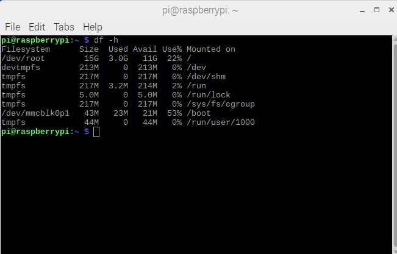
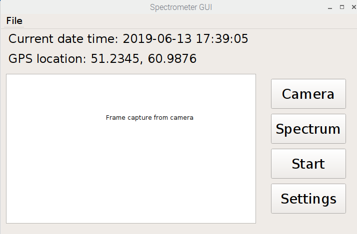

## Instructions for cloning OS image and run GUI app
Most current image available on [Google Drive](https://drive.google.com/drive/u/0/folders/1s-zRTGhcLGHEpJTI93D9O8YIeo6DgwfC).

### Image version log
- Build 13.06.19: Raspian + PyQt5. 


### Flash OS Image on SD-Card
[raspberrypi.org - Installing operating system images](https://www.raspberrypi.org/documentation/installation/installing-images/README.md)

`sudo dd bs=4M if=pizero_ARP_gui_compiled_20190613_shrunk.img of=/dev/sde status=progress conv=fsync`

###  Re-Expand Root Partition on Raspberry Pi 

`sudo raspi-config --expand-rootfs`

Whenf inished, **reboot Raspberry Pi**.

### Check that the partition is expanded
```bash
df -h
```
The root partition should now take the whole SD card volume


### Test GUI application
Get the zipped Source Code version 130619 from https://github.com/yenthusiastic/ARP07/tags
Extract the zip file and run the GUI
```bash
cd ARP07-b130619
sudo python3 main.py        #sudo is required to control GPIO pins
```
GUI of version 130619 looks like follows
